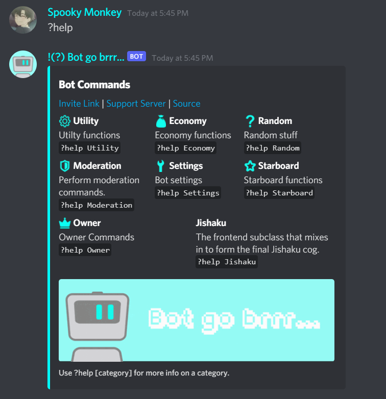
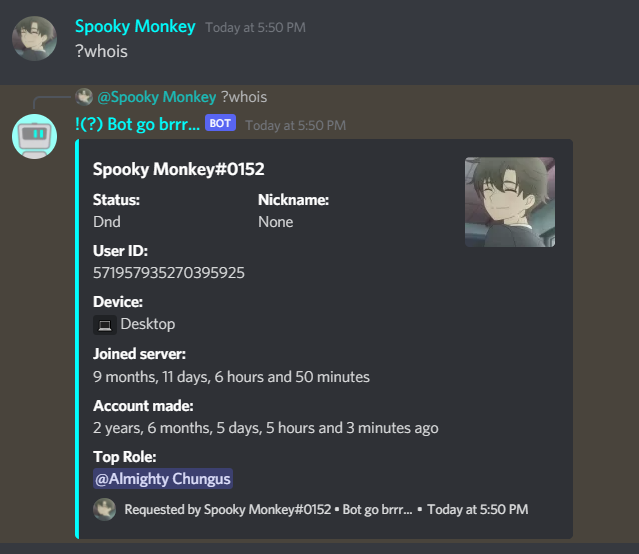
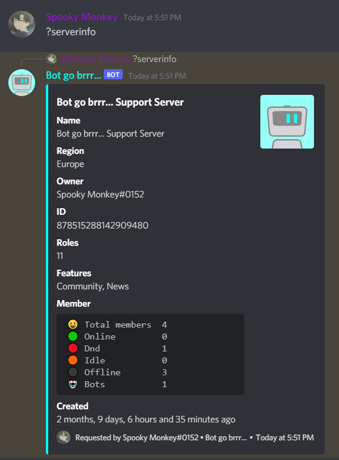
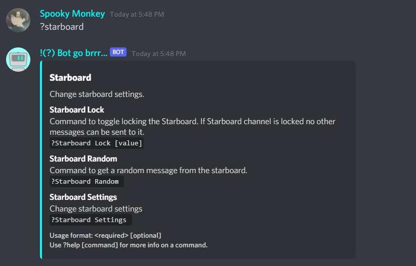

# Bot go brrr...
A bot made for specific server needs.
Table format is saved in the Tables Folder. Make these tables in your database.

### Functions:

* Upvote/Downvote based Karma system
* Server Economy 
* An award system
* Events
* Starboard
* Auto-reactions in meme and suggestion channels

### To run the bot:
1. To deploy this bot create a .env file similiar like to the one in the sample. 
2. Enter your bot token and database details in it.
3. Install all the required modules with: 
```
sudo pip3 install -r requirements.txt
```
4. Run the code!

### Images
   
*Help command*
   
*Balance command*
   
*Awards command*
   
*Spin command*
   
*Whois command*
   
*Server info command*
   
*leaderboard command*
   
*Starboard command*


