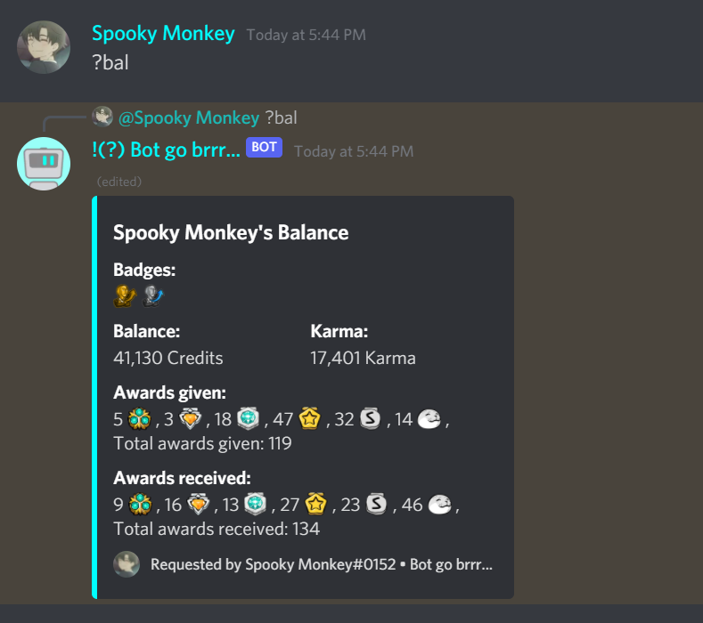

# Bot go brrr...
A bot made for specific server needs.
### Functions:

* Upvote/Downvote based Karma system
* Server Economy 
* An award system
* Events
* Starboard
* Auto-reactions in meme and suggestion channels

### To run the bot plain on your machine:
1. Copy .env.example to a .env file
2. Modify the created .env file and insert the settings needed
3. Install all the required python3 modules: 
```
sudo pip3 install -r requirements.txt
```
4. Run the bot:
```
python3 bot.py 
```

### To run the bot using docker:
1. Copy .env.example to a .env file
2. Modify the created .env file and insert the settings needed
3. Build the docker container
```
docker build -t botgobrrr .
```
4. Run the bot:
```
docker run botgobrrr
```


### Images
   
*Help command*

   
*Balance command*

   
*Awards command*

   
*Spin command*

   
*Whois command*

   
*Server info command*

   
*leaderboard command*

   
*Starboard command*
